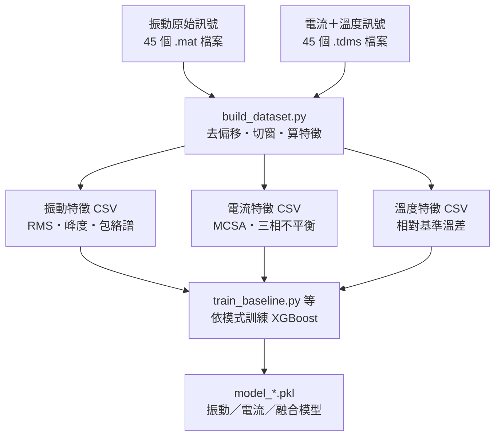

# FactoryPulse

多感測器旋轉機械故障診斷平台 — 結合振動、電流、溫度三模態特徵、XGBoost 分類與規則引擎融合，並以 LLM 產生可解釋的維修建議。

以 [KAIST/Hyundai 旋轉機械資料集](https://data.mendeley.com/datasets/ztmf3m7h5x)（Vibration, Acoustic, Temperature, and Motor Current Dataset of Rotating Machine Under Varying Load Conditions for Fault Diagnosis, CC BY 4.0）為基礎驗證。

## 核心理念

分類器只回答「是什麼故障、多確定」，不回答「多嚴重、要不要停機」——這兩件事被拆成兩層，避免黑盒模型把診斷跟決策混在一起：

- **模型層**：各感測模態各自訓練 XGBoost，輸出故障類別與異常機率
- **規則層**：跨感測交叉驗證、風險分級、是否停機，全部是可追溯的門檻邏輯，不是模型學出來的
- **語言層**：LLM 只負責把結構化診斷結果轉成人看得懂的文字，禁止自行編造診斷內容

每一個結論都能回溯到具體的物理量測（例如包絡譜在軸承特徵頻率的能量、相對正常基準的溫差倍數），而不只是一個信心分數。

## 系統流程

### 1. 離線訓練 pipeline



原始訊號先做包絡解調，鎖定軸承內外環特徵頻率（BPFO 183.5 Hz / BPFI 268.8 Hz）與轉頻諧波（1x 50.2 Hz、3x 150.4 Hz）的譜線強度，特徵本身就對應已知的故障機制，不是丟一堆統計量讓模型硬學。

### 2. 執行期診斷流程

```mermaid
flowchart TD
    F1[廠內模擬訊號<br/>factory_sim 逐分鐘取樣] --> G[dashboard_data.diagnose&#40;&#41;<br/>載入模型並執行推論]
    F2[使用者上傳檔案<br/>.mat / .tdms / .csv] --> G
    G --> H1[振動模型<br/>XGBoost，5 類分類]
    G --> H2[電流模型<br/>XGBoost，5 類分類]
    G --> H3[溫度趨勢<br/>不分類，只判斷惡化]
    H1 --> I[rule_engine 加權融合<br/>振動 65%・電流 25%・溫度 10%]
    H2 --> I
    H3 --> I
    I --> J1[knowledge_base<br/>原因・檢查・建議行動]
    I --> J2[evidence.py<br/>比對正常基準倍數]
    J1 --> K[llm_assistant.py<br/>生成可解釋文字說明]
    J2 --> K
    K --> L1[廠區總覽]
    K --> L2[設備診斷]
    K --> L3[多感測證據]
    K --> L4[即時診斷]
```



溫度不參與故障分類（樣本量太少，直接訓練會有標籤洩漏風險），只用來判斷異常是否持續惡化、要不要提升處理急迫度。

## 兩種運轉模式

| 模式 | 資料集 | 故障類別 | 感測來源 | 模型架構 |
|---|---|---|---|---|
| 定轉速・變負載 | 3010 RPM，0/2/4 Nm | 正常／內圈／外圈／不對心／不平衡（5 類） | 振動＋電流＋溫度 | 振動、電流各自獨立模型，可跨感測交叉驗證 |
| 變轉速 | 618~2480 RPM 連續變化 | 正常／內圈／外圈／滾動體（4 類） | 振動＋電流 | 振動＋電流合併輸入的單一融合模型，沒有溫度資料 |

## 儀表板頁面

- **廠區總覽**：10 台同型 CNC 的廠房佈局與健康狀態，每分鐘更新
- **設備診斷**：單一機台的完整診斷結果與建議行動
- **多感測證據**：AI 判斷依據的可解釋性展示（物理證據、模型投票分布、特徵重要度）
- **即時診斷**：上傳原始感測檔（.mat / .tdms / .csv），系統自動轉檔並診斷

## 已知限制

- 聲音（acoustic）模態因資料量不足（45 個檔案中只有 5 個）已從系統中移除，列為未來擴充方向
- 溫度門檻是用本資料集 60~300 秒的錄音校出來的，實際部署時須用設備自身的長期資料重新校正
- 不對心（Misalign）與不平衡（Unbalance）在跨負載測試中容易互相混淆，系統會主動揭露此辨識限制而非隱藏

## 執行方式

```bash
cd factorypulse_preprocessing
pip install -r requirements.txt

# 1. 前處理：從原始感測檔產生特徵 CSV
python build_dataset.py

# 2. 訓練模型
python train_baseline.py     # 定轉速・變負載模式
python train_speed.py        # 變轉速模式

# 3. 啟動儀表板
streamlit run app.py
```

## 資料來源

*Vibration, Acoustic, Temperature, and Motor Current Dataset of Rotating Machine Under Varying Load Conditions for Fault Diagnosis*，KAIST，Mendeley Data, DOI: 10.17632/ztmf3m7h5x，CC BY 4.0。
